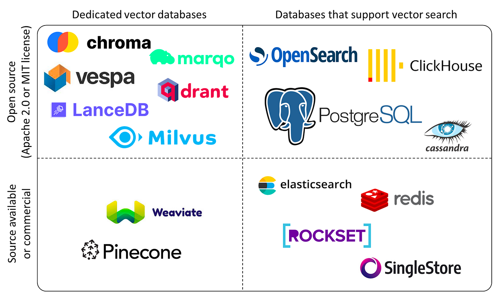

## สร้าง Postgresql vector Database จาก Docker compose


file: docker-compose.yml ใน Folder postgresql-compose แล้ว

```yml
version: '3.8'

services:
  postgres:
    image: ankane/pgvector:latest
    container_name: pgvector_db
    environment:
      POSTGRES_USER: postgres
      POSTGRES_PASSWORD: postgres
      POSTGRES_DB: vectordb
    ports:
      - "5432:5432"
    volumes:
      - postgres_data:/var/lib/postgresql/data
    healthcheck:
      test: ["CMD-SHELL", "pg_isready -U postgres"]
      interval: 5s
      timeout: 5s
      retries: 5

volumes:
  postgres_data:
```
## เริ่มการสร้าง 
ใน ทำใน Terminal ก่อน ใช้คำสั่ง cli

### 1. เพื่ม user ในกลุ่ม docker 
```bash
# add user to docker group 
$ sudo docker ps
$ sudo usermod -aG docker $USER
$ newgrp docker

$ docker ps


# Run docker compose
$ cd postgresql-compose
$ docker compose up -d

$ docker ps
```

### 2. การ connect to database ผ่านทาง docker exec command
เราสามารถส่งคำสั่ง `psql -U postgres -d vectordb` ไปยัง pgvector_db container

```bash
$ docker exec -it pgvector_db psql -U postgres -d vectordb
```

Result
```
$ docker exec -it pgvector_db psql -U postgres -d vectordb
psql (15.4 (Debian 15.4-2.pgdg120+1))
Type "help" for help.

vectordb=# 
```


### 3. Enable pgvector extension
vector exension ไม่ได้เป็น default จะต้องมีการ `CREATE EXTENSION`
```sql
vectordb=# CREATE EXTENSION IF NOT EXISTS vector;
vectordb=# SELECT * FROM pg_available_extensions WHERE name = 'vector';
vectordb=# \q
```
Result ที่ได้
```
  name  | default_version | installed_version |                       comment
--------+-----------------+-------------------+------------------------------------------------------
 vector | 0.5.1           | 0.5.1             | vector data type and ivfflat and hnsw access methods
(1 row)
```
- เราก็จะเห็น vector extension
  


## PgVector in PostgreSQL: Vector Similarity for machine Learning


cosine similar 
  
ตัวอย่างแนวคิด


### 1 create database
สร้าง Database โดยมีชนิด vector เพื่อเก็บค่าที่ได้จาก Embeded และ Content เก็บต้นฉบับของคำ

```sql
CREATE TABLE test (
  id bigserial PRIMARY KEY,
  content text,
  embedding vector(1024)  
);
```
### command
- `\list` or `\l`: list all databases
- `\c <db name>`: connect to a certain database
- `\dt`: list all tables in the current database using your search_path
- `\dt *`.: list all tables in the current database regardless your search_path


## หรือ ลอง Connect Database with `psql` command เนื่องจาก ติดตั้ง cli แล้ว
```
psql -h localhost -p 5432 -U postgres -d vectordb

# หรือ ให้ ip-server 
psql -h ip-server -p 5432 -U postgres -d vectordb
```
result
```
Password for user postgres: 
psql (16.9 (Ubuntu 16.9-0ubuntu0.24.04.1), server 15.4 (Debian 15.4-2.pgdg120+1))
Type "help" for help.

vectordb=# \q 
```
## Vector Database ที่มีใช้อยู่



## Vector Database และ การค้นหา แบบ similarity
แปลง ข้อมูลที่ได้ให้ให้อยู่ในรูปแบบของ Array ของ ตัวเลข


ต่อไปก็ไปเรียบร้อย ในการเชื่อมต่อ Database เพิ่มเติม [next part 2](./Part2_connectDb.md)