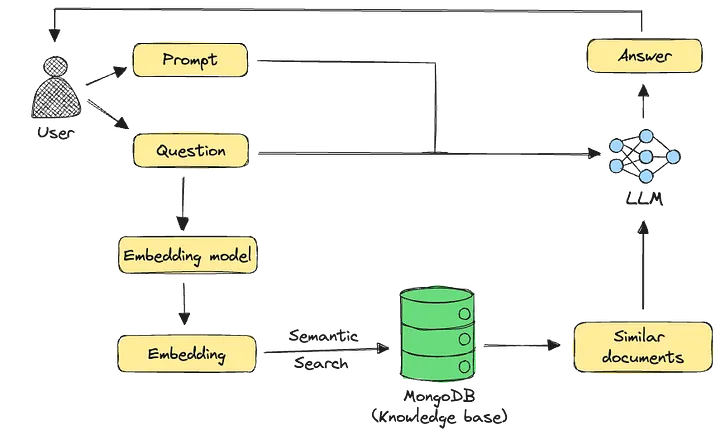

# Connect Database ด้วย python

จาก ตอนที่แล้วได้สร้าง Data เรียบร้อย ต่อไป จะทำการเขียน โปรแกรมภาษา Python สำหรับการเชื่อมต่อ โดย จะเขียนบน jupyter notebook ขั้นตอนดังนี้
- Ref sentence-transformer [https://sbert.net/](https://sbert.net)

### install dependecies
```bash
cd ~

sudo apt install python3
sudo apt install python3-pip

# create project folder
cd ~
mkdir pythonllm
cd pythonllm
python3 -m venv .venv
source .venv/bin/activate

(.venv) $  
# install python module

(.venv) $ pip install psycopg2-binary
(.venv) $ pip install sentence-transformers
(.venv) $ pip install jupyter notebook

# install jupyter kernel และสร้าง kernel 
(.venv) $ pip install ipykernel
(.venv) $ python -m ipykernel install --user --name=kernel_env --display-name="Kernel_env"

# result
Installed kernelspec kernel_env in /home/vagrant/.local/share/jupyter/kernels/kernel_env
```

## เปรียบเทียบ Workspace vs Kernel ใน python

การเปรียบเทียบ Workspace ใน Python กับ ห้องทำงาน และ ipykernel กับ ผู้ที่ทำงาน (Actor) เป็นการเปรียบเทียบที่น่าสนใจและสามารถอธิบายแนวคิดได้ดีในระดับหนึ่ง โดยสามารถอธิบายได้ดังนี้:

1. Workspace (โฟลเดอร์หรือสภาพแวดล้อมการทำงาน) ≈ ห้องทำงาน
Workspace ใน Python (เช่น โฟลเดอร์โปรเจกต์, Jupyter Notebook, หรือสภาพแวดล้อมแบบ Interactive) เป็นพื้นที่ที่คุณเก็บ โค้ด, ข้อมูล, และผลลัพธ์ ไว้ เหมือนกับห้องทำงานที่คุณมีเอกสาร เครื่องมือ และอุปกรณ์ต่างๆ ไว้ใช้ทำงาน

ในห้องทำงาน คุณมี โต๊ะทำงาน (ตัวแปรใน Memory), ไฟล์เอกสาร (ไฟล์ .py หรือ .ipynb), และ เครื่องมือ ( Libraries/Packages) ที่ต้องใช้ในการทำงาน

2. ipykernel ≈ ผู้ที่ทำงาน (Actor) หรือ "สมอง" ของกระบวนการ
ipykernel เป็นตัวประมวลผลที่ทำงานอยู่เบื้องหลัง (เช่น ใน Jupyter Notebook) คอยรับคำสั่ง Python ที่คุณป้อนเข้าไปแล้วประมวลผลออกมาเป็นผลลัพธ์

มันทำหน้าที่เหมือน คนทำงาน ในห้องที่รับงาน (โค้ด) จากคุณ แล้วประมวลผลให้ (รันโค้ด, คำนวณ, ส่งผลลัพธ์กลับ)

ถ้าไม่มี ipykernel (หรือ Kernel อื่นๆ) โค้ดของคุณก็จะไม่ถูกประมวลผล เหมือนห้องทำงานที่ไม่มีคนทำงานอยู่

Kernel ยังจัดการ สถานะของตัวแปร (Memory) ใน Session นั้นๆ ด้วย เหมือนคนทำงานที่จำสิ่งที่เกิดขึ้นในห้องได้ตราบใดที่ยังไม่ปิดห้อง


### Run jupyter notebook ได้เลย
```
# run notebook ใน Local Environment
(.venv) $ jupyter notebook

# connect จาก Remoteserver (recommend) 
# หา public ip เพื่อจะใช้งาน ผ่าน public ip
(.venv) $ ip a  

3: eth1: <BROADCAST,MULTICAST,UP,LOWER_UP> mtu 1500 qdisc fq_codel state UP group default qlen 1000
    link/ether 08:00:27:bd:8d:0e brd ff:ff:ff:ff:ff:ff
    altname enp0s8
    inet 192.168.56.15/24 brd 192.168.56.255 scope global eth1
       valid_lft forever preferred_lft forever
    inet6 fe80::a00:27ff:febd:8d0e/64 scope link
       valid_lft forever preferred_lft forever

```
## Run jupyter notebook : External Access
เมื่อ Run คำสั่งแล้ว จะต้องไปเปิด browser ไปยัง Url `http://192.168.56.15:8888`

```
(.venv) $ mkdir basic-jupyter
(.venv) $ cd basic-jupter

(.venv) $ jupyter notebook --ip=0.0.0.0  --port=8888  --no-browser  --allow-root --NotebookApp.token='password' --NotebookApp.password=''

```

### คำอธิบายคำสั่ง ดังต่อไปนี้
```
jupyter notebook \
  --ip=0.0.0.0 \           # Listen on all network interfaces
  --port=8888 \            # Default port (change if needed)
  --no-browser \           # Don't open browser automatically
  --allow-root \           # If running as root (not recommended for production)
  --NotebookApp.token='your_password' \  # Set a password
  --NotebookApp.password=''  # Disable token-only auth
```
- สังเกตุ เห็น (.venv) บอกว่าตอนนี้ อยู่ใน Environment
- ติดตั้ง jupyter notebook ใช้ เป็น Editor


Add password


Add new notebook file


Select kernel


Change name


### Start Develop บน Jupyter notewok
- install dependecies โดยพิมพ์ ในส่วนของ Code Block
- จะต้อง ใส่เครื่องหมาย `!` ก่อนหน้าคำสั่ง เพื่อเป็นการให้ทำงานเหมือนกับ run ใน terminal โดยตรง
- หลังจากนั้น จะทำการ Run code block ด้วยการกด `Ctrl+enter`
   
```
!pip install sentence-transformers
!pip install einop
```


### เรียนรู้การใช้ LLM Model


#### ข้อมูลจำเพาะ Model

| โมเดล                  | มิติ | ภาษา支持      | ข้อดี                          |
|------------------------|------|--------------|-------------------------------|
| nomic-embed-text-v1    | 768  | หลายภาษา     | ประสิทธิภาพดี ความเร็วสูง       |
| mxbai-embed-large-v1   | 1024 | หลายภาษา     | ความแม่นยำสูง                  |

ขั้นตอน 




- [https://huggingface.co/mixedbread-ai/mxbai-embed-large-v1](https://huggingface.co/mixedbread-ai/mxbai-embed-large-v1)


#### สร้าง embeded_model.ipynb ใน  jupyter


- BAAI/bge-m3 [https://huggingface.co/BAAI/bge-m3](https://huggingface.co/BAAI/bge-m3)
- nomic-ai/nomic-embed-text-v1 [https://huggingface.co/nomic-ai/nomic-embed-text-v1](https://huggingface.co/nomic-ai/nomic-embed-text-v1)
- mixedbread-ai/mxbai-embed-large-v1 [https://huggingface.co/mixedbread-ai/mxbai-embed-large-v1](https://huggingface.co/mixedbread-ai/mxbai-embed-large-v1)
  
#### สร้าง code ใน jupyter notebook
```python
from sentence_transformers import SentenceTransformer

# 1 โหลดโมเดล ทดสอบ 
# SentenceTransformers จะทำการ Download model ให้เราเอง อัตตโนมัติ
model = SentenceTransformer('BAAI/bge-m3')
#model = SentenceTransformer('nomic-ai/nomic-embed-text-v1.5', trust_remote_code=True)
#model = SentenceTransformer('mixedbread-ai/mxbai-embed-large-v1')

# 2 สร้าง embeddings
sentences = ["สวัสดีครับ", "ประเทศไทย", "การเรียนรู้ภาษาไทย"]
embeddings = model.encode(sentences)
embeddings

print(f"Embedding shape: {embeddings.shape}")  # Output: (768,) or (1024,) depending on the model
print(f"Embedding size: {embeddings.shape[0]} dimensions")

# 3 คำนวน embedding similarities

similarities = model.similarity(embeddings, embeddings)
print(similarities)

```


- download model มาใช้งาน


### คำความเข้าใจ psycopg2 เพือทำการสร้าง Connection กับ postgresql Database


### Psycopg2 lib
psycopg2 is a popular Python library for working with PostgreSQL databases. It is a PostgreSQL adapter for Python that provides a Python interface to the PostgreSQL database.

With psycopg2, you can connect to a PostgreSQL database and perform various operations on the data stored in the database, such as inserting, updating, or deleting data. You can also use psycopg2 to retrieve data from the database and perform analysis or other operations on the data.


To install the psycopg2 library, you will need to use a package manager like pip. Open a terminal or command prompt window and type the following command:

```bash
!pip install psycopg2-binary
!pip install numpy
```

 The problem: The connection and cursor are not being closed. This can lead to resource leaks.
- Python doesn't automatically close database connections
- The try block only handles connection errors, not cleanup
- Cursors/connections remain open until garbage collected (non-deterministic)

Basic Template python Connection
```python
import psycopg2 

conn = None  # Initialize to avoid NameError in finally
try:

    conn = psycopg2.connect(
        dbname="vectordb",
        user="postgres",
        password="postgres",
        host="localhost"
    )
   

    cursor = conn.cursor()
    print("Connection established.")
    # ... your database operations here ...

except Exception as err:
    print("Something went wrong.")
    print(err)
finally:
    # Cleanup resources in reverse order
    if 'cursor' in locals() and cursor:  # Check if cursor exists
        cursor.close()
    if conn:  # Check if connection exists
        conn.close()
    print("Resources released.")
```


### ต่อมา สร้าง file python_connectdb.ipynb
- สร้างไฟล์ ใน jupyter notebook
  
```python
import psycopg2
from psycopg2 import sql

# Connect to your PostgreSQL database
conn = psycopg2.connect(
    dbname="vectordb",
    user="postgres",
    password="postgres",
    host="localhost"
)

try:
    with conn.cursor() as cur:
        cur.execute("CREATE EXTENSION IF NOT EXISTS vector;")
        # Create table if it doesn't exist
        cur.execute("""
            CREATE TABLE IF NOT EXISTS documents (
                id serial PRIMARY KEY,
                content text,
                embedding vector(1024),
                created_at timestamptz DEFAULT now()
            );
        """)
        conn.commit()
        print("Table created successfully or already exists")
        
        # Verify table exists
        cur.execute("""
            SELECT EXISTS (
                SELECT FROM information_schema.tables 
                WHERE table_name = 'documents'
            );
        """)
        exists = cur.fetchone()[0]
        print(f"Table exists: {exists}")
        
except Exception as e:
    print(f"Error: {e}")
    conn.rollback()
finally:
    cur.close()  # ปิด Cursor ก่อน
    conn.close() # แล้วปิด Connection
```


จากตัวอย่างด้านบน เราจะ Refactor ให้รูปแบบที่เป็น function เพื่อให้สามารถ reuse ได้
- ดูเพิ่ม เติมการใช้งาน [https://www.psycopg.org/docs/sql.html](https://www.psycopg.org/docs/sql.html)

### Convert to Fuction
- ให้ทำการ ลบ Database documents ใน Database ก่อน ให้เข้าไปที่ folder ของ postgresql-compose/
- run docker exec 
```
# linux shell
$ docker exec -it pgvector_db psql -U postgres -d vectordb

# postgresql shell
vectordb=# \dt
vectordb=# drop table documents
```


# เปลี่ยนให้เป็น function สำหรับการสร้าง Database
```python
import psycopg2
from psycopg2 import sql

def create_vector_table(
    dbname="vectordb",
    user="postgres",
    password="postgres",
    host="localhost",
    table_name="items",
    vector_dim=3
):
    """
    Creates a PostgreSQL table with a vector column if it doesn't exist.
    
    Args:
        dbname (str): Database name
        user (str): Database user
        password (str): Database password
        host (str): Database host
        table_name (str): Name of the table to create
        vector_dim (int): Dimension for the vector column
        
    Returns:
        tuple: (success: bool, message: str)
    """
    conn = None
    try:
        # Connect to PostgreSQL
        conn = psycopg2.connect(
            dbname=dbname,
            user=user,
            password=password,
            host=host
        )
        
        with conn.cursor() as cur:
            # Ensure vector extension exists
            cur.execute("CREATE EXTENSION IF NOT EXISTS vector;")
            
            # Create table with vector column
            cur.execute(sql.SQL("""
                CREATE TABLE IF NOT EXISTS {} (
                    id serial PRIMARY KEY,
                    content text,
                    embedding vector({}),
                    created_at timestamptz DEFAULT now(),
                    metadata jsonb
                );
            """).format(
                sql.Identifier(table_name),
                sql.Literal(vector_dim)
            ))
            
            conn.commit()
            
            # Verify table creation
            cur.execute(sql.SQL("""
                SELECT column_name, data_type 
                FROM information_schema.columns 
                WHERE table_name = {};
            """).format(sql.Literal(table_name)))
            
            columns = cur.fetchall()
            column_names = [col[0] for col in columns]
            
            message = f"Table '{table_name}' created with columns: {column_names}"
            return (True, message)
            
    except psycopg2.Error as e:
        error_msg = f"Database error occurred: {e}"
        if conn:
            conn.rollback()
        return (False, error_msg)
        
    except Exception as e:
        error_msg = f"Unexpected error: {e}"
        return (False, error_msg)
        
    finally:
        if conn:
            conn.close()

# Example usage
if __name__ == "__main__":
    success, message = create_vector_table(
        table_name="documents",
        vector_dim=768  # For larger embeddings
    )
    print(f"Success: {success}")
    print(f"Message: {message}")
```

> **Note:** if __name__ == "__main__" ไม่จำเป็นต้องใช้ ในการ Run ใน jupyter  
> ใช้สำหรับการ Run แบบ Cli


## ทบทวนความรู้ With expression [as variable]: with-block
The with statement in Python is used for resource management and exception handling. It simplifies working with resources like files, network connections and database connections by ensuring they are properly acquired and released. When we open a file, we need to close it ourself using close(). But if something goes wrong before closing, the file might stay open, causing issues. Using with open() automatically closes the file when we're done, even if an error happens.

example.txt file contains:

 Hello, World!

Example 1 : Without with (Manual closing)
```
file = open("example.txt", "r")
try:
    content = file.read()
    print(content)
finally:
    file.close()  # Ensures the file is closed
```
**Explanation:** This code opens "example.txt" in read mode, reads its content, prints it and ensures the file is closed using a finally block.

Example 2: using with(Automatic closing)
```
with open("example.txt", "r") as file:
    content = file.read()
    print(content)  # File closes automatically
```

**Explanation:** with open(...) statement reads and prints the file's content while automatically closing it, ensuring efficient resource management without a finally block

### Advantages of the with statement
- **Simplifies Resource Management :** with statement ensures that resources are properly acquired and released, reducing the likelihood of resource leaks.
- **Replaces Try-Except-Finally Blocks:** Traditionally, resource management required try-except-finally blocks to handle exceptions and ensure proper cleanup. The with statement provides a more concise alternative.
- **Enhances Readability:** By reducing boilerplate code, the with statement improves code readability and maintainability.

### Function Add text and vector

```python
import psycopg2
from psycopg2 import sql

from sentence_transformers import SentenceTransformer

model = SentenceTransformer('BAAI/bge-m3')
#model = SentenceTransformer('nomic-ai/nomic-embed-text-v1.5', trust_remote_code=True)
#model = SentenceTransformer('mixedbread-ai/mxbai-embed-large-v1')

conn = psycopg2.connect(
    dbname="vectordb",
    user="postgres",
    password="postgres",
    host="localhost"
)

def add_documents(text: str) -> bool:
    """
    Adds a document to the PostgreSQL database with its text embedding.
    
    Args:
        text: The text content to be stored
        
    Returns:
        bool: True if successful, False if failed
    """
    conn = None
    try:
        # Generate embedding
        embedding = model.encode(text)
        
        # Connect to PostgreSQL
        conn = psycopg2.connect(
            dbname="vectordb",
            user="postgres",
            password="postgres",
            host="localhost"
        )
        
        with conn.cursor() as cur:
            # Convert numpy array to PostgreSQL compatible format
            embedding_list = embedding.tolist()
            # Insert document and embedding
            cur.execute(
                "INSERT INTO documents (content, embedding) VALUES (%s, %s)",
                (text, embedding_list)
            )
            conn.commit()
        return True
        
    except Exception as e:
        print(f"Error adding document: {e}")
        if conn:
            conn.rollback()
        return False
        
    finally:
        if conn:
            conn.close()

# data สำหรับการ Embedding
documents = [
    "วันพุธ	1 มกราคม	วันขึ้นปีใหม่",
    "วันพุธ	12 กุมภาพันธ์	วันมาฆบูชา",
    "วันจันทร์	7 เมษายน	วันหยุดชดเชยวันจักรี",
    "วันจันทร์	14 เมษายน	วันสงกรานต์",
    "วันอังคาร	15 เมษายน	วันสงกรานต์",
    "วันพฤหัสบดี	1 พฤษภาคม	วันแรงงานแห่งชาติ ",
    "วันจันทร์	5 พฤษภาคม	วันหยุดชดเชยวันฉัตรมงคล",
    "วันศุกร์	9 พฤษภาคม	วันพืชมงคล (หยุดเฉพาะราชการ)",
    "วันจันทร์	12 พฤษภาคม	วันหยุดชดเชยวันวิสาขบูชา",
    "วันจันทร์	2 มิถุนายน	วันหยุดพิเศษ",
    "วันอังคาร	3 มิถุนายน	วันเฉลิมพระชนมพรรษาสมเด็จพระนางเจ้าสุทิดา",
    "วันพฤหัสบดี	10 กรกฎาคม	วันอาสาฬหบูชา",
    "วันศุกร์	11 กรกฎาคม	วันเข้าพรรษา (หยุดเฉพาะราชการ)",
    "วันจันทร์	28 กรกฎาคม	วันเฉลิมพระชนมพรรษาพระบาทสมเด็จพระเจ้าอยู่หัว",
    "วันจันทร์	11 สิงหาคม	วันหยุดพิเศษ",
    "วันอังคาร	12 สิงหาคม	วันแม่แห่งชาติ",
    "วันจันทร์	13 ตุลาคม	วันนวมินทรมหาราช",
    "วันพฤหัสบดี	23 ตุลาคม	วันปิยมหาราช",
    "วันศุกร์	5 ธันวาคม	วันคล้ายวันพระราชสมภพรัชกาลที่ 9 วันชาติ และ วันพ่อแห่งชาติ",
    "วันพุธ	10 ธันวาคม	วันรัฐธรรมนูญ",
    "วันพุธ	31 ธันวาคม	วันสิ้นปี",
]

for doc in documents:
    add_documents(doc)
```

# Verify Data in Vector Database
```
def print_five_documents():
    """
    Prints the first 5 documents from the database for verification
    """
    conn = None
    try:
        conn = psycopg2.connect(
            dbname="vectordb",
            user="postgres",
            password="postgres",
            host="localhost"
        )
        
        
        with conn.cursor() as cur:
            cur.execute("SELECT id, content, embedding FROM documents LIMIT 5")
            rows = cur.fetchall()
            
            print("\nVerifying documents (first 5 rows):")
            print("-" * 50)
            for row in rows:
                print(f"ID: {row[0]}")
                print(f"Content: {row[1][:100]}...")  # Print first 100 chars of content
                print(f"Embedding length: {len(row[2])}")
                print("-" * 50)
                
    except Exception as e:
        print(f"Error fetching documents: {e}")
        
    finally:
        if conn:
            conn.close()
#Usage
print_five_documents()
```
### ผลลัพธ์การ verify Data


### ดูจาก dbweaver app หรือ Database client ที่ใช้


---
## หา Similatiy

```python
from sentence_transformers import SentenceTransformer
model = SentenceTransformer('BAAI/bge-m3')

def query_postgresql(query_text, k=5):
    query_embedding = model.encode(query_text).tolist()
    print(query_embedding)

    # แปลง vector เป็น String
    query_embedding_str = "["+ ",".join(map(str,query_embedding)) + "]"
    print(query_embedding_str)
    
    conn = None
    try:
        conn = psycopg2.connect(
            dbname="vectordb",
            user="postgres",
            password="postgres",
            host="localhost"
        )
        # <=> คำนวนควาเหมือน ยิ่งน้อย ยิ่งเหมือน
        sql_query = """
            SELECT content, embedding <=> %s::vector AS similarity_score
            FROM  documents
            ORDER BY  similarity_score ASC
            LIMIT %s
        """
        
        with conn.cursor() as cur:
            cur.execute(sql_query,(query_embedding_str,k))
            results = cur.fetchall()
            
        return results
                
    except Exception as e:
        print(f"Error fetching documents: {e}")
        
    finally:
        if conn:
            conn.close()
#Usage
resutls = query_postgresql("วันหยุดเดือน มกราคม")
print(resutls)
                     
```

## Install ollama
```
!pip install ollama
```

```python

import ollama

prompt = "ประเทศไทยมีประชากรเท่าไหร่"  

response = ollama.chat(
    model="llama3.2",  
    messages=[
        {"role": "system", "content": "You are a helpful assistant."},
        {"role": "user", "content": prompt}
    ]
)

print(response["message"]["content"])import ollama
```


# generate Response from ollama
```python
import ollama

def generate_response(query_text):
    # 1. Retrieve relevant documents from PostgreSQL
    retrieved_docs = query_postgresql(query_text, 3)  # Fixed typo in variable name
    
    # 2. Prepare context from retrieved documents
    context = "\n".join([doc[0] for doc in retrieved_docs])
    print("=== Retrieved Context ===")
    print(context)
    
    # 3. Construct the prompt with context
    prompt = f"""Answer the question based on the following context:
{context}

Question: {query_text}
"""
    print("\n=== Generated Prompt ===")
    print(prompt)
    
    # 4. Generate response using Ollama
    try:
        response = ollama.chat(
            model="llama3.2",  # Corrected model name (no "llama3.2")
            messages=[
                {"role": "system", "content": "You are a helpful assistant that answers questions about Thailand."},
                {"role": "user", "content": prompt}
            ]
        )
        
        # 5. Return the generated response
        generated_answer = response["message"]["content"]
        print("\n=== Generated Answer ===")
        print(generated_answer)
        return generated_answer
        
    except Exception as e:
        print(f"Error generating response: {e}")
        return None

# Example usage
generate_response("วันสงกรานต์")
```
